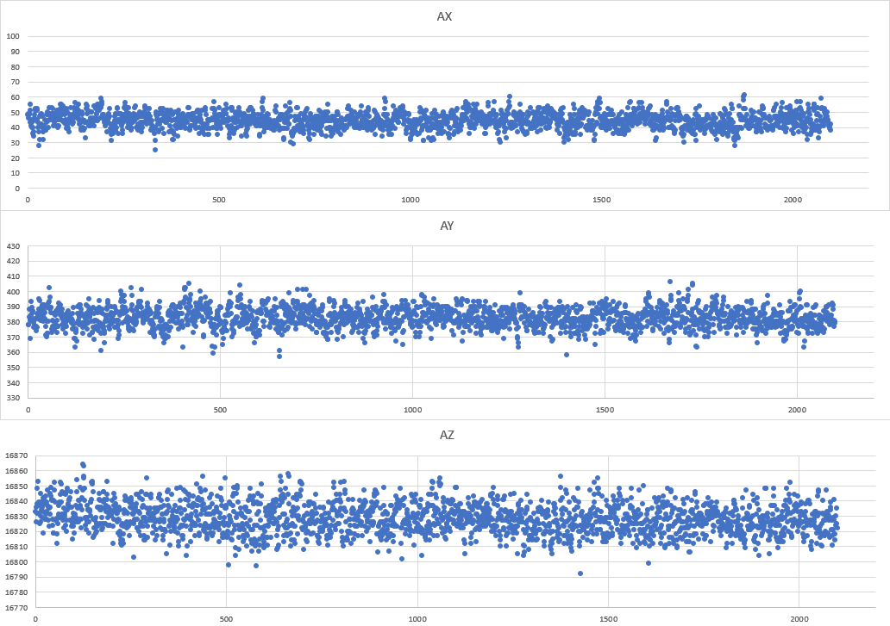
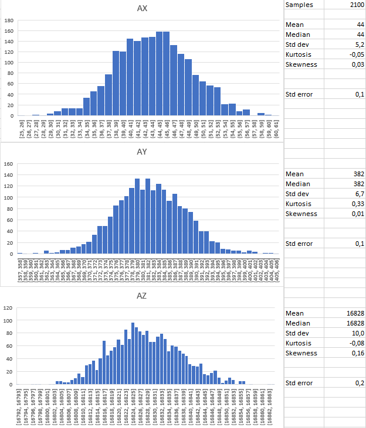

# IMU calibration

The car contains an inertial measurement unit (IMU), an LSM9DS1 9DoF MARG sensor (Magnetic, Angular Rate and Gravity), which needs to be calibrated. When booting, if there is no calibration data it will stop execution.
Calibration data is stored in a file, in the spiffs filesystem located in its own [partition](https://github.com/nostromo-1/robotic-car-ESP32/blob/master/partition%20tables.md).

Calibration can be entered in the boot sequence, by pressing the push button when the display says "CALIB?". It will then display the text `HORIZ. WAIT`
on the display. You have to leave the car on a level surface, with no motion, during the initial part of the calibration; in the second part, you have to slowly rotate the car in all directions.

It will be performed in 3 steps, the firt two steps are the initial part of the calibration:
* Calibration of the accelerometer and gyroscope: During 10 seconds, while stationary on a level surface, it will continously read both instruments, and then calculate the mean value of the samples (which will be stored as the bias error) and their standard deviation (which will also be stored in a file)
* Sampling of the magnetometer: During 8 more seconds, and still with the car stationary and horizontal, it will read the magnetometer and calculate the standard deviation of the samples (and store them in a file)
* Calibration of the magnetometer: The text `ROTATE CAR...` will appear on the display, and the buzzer will briefly piep. Take the car, and slowly rotate it in all directions, over all 3 axis, for 30 seconds, until the buzzer pieps again. During this time, samples will be taken which will help calculate the hardiron and softiron correction parameters of the magnetometer.

After calibration is complete, it will store the results in 2 files:
* `calibration.dat` contains the offset bias of the accelerometer and gyroscope, and the hardiron and softiron parameters of the magnetometer
* `deviation.dat` contains the standard deviation of the samples of all 3 instruments

These files can be accessed over the built-in http server, if there is a wifi connection with DHCP server. Upon boot, the assigned IP address of the car will appear on the display. Type the following text in a browser connected to the same wifi network: `http://192.168.1.xx/spiffs/calibration.dat` or `http://192.168.1.xx/spiffs/deviation.dat`, using the IP address of your car.

## Accelerometer and gyroscope
These instruments are read continously during the calibration; each value is read for the 3 axis (X, Y and Z). The accelerometer should read zero in all 3 axis except the vertical (Z), where it should read the gravitatory force (which is undistinguisable from an acceleration, this is the equivalence principle, basis of the theory of relativity). The calibration assumes that the car is near the Earth surface and not on a satellite, and thus it assumes a 1g gravitation acceleration. The gyroscope should read zero in all 3 axis.

Instead of zero, some value will be read in each sample during calibration; this is the bias error, which will later (during operation) be substracted from the sampled values to obtain the real values. The calibration phase calculates these bias errors (one for each axis). The sampled values are not constant; instead, they are a random stochastic process, which can be modelled as gaussian noise around a certain value (its mean value).

This is an example of several samples taken from the accelerometer during calibration:

The histograms and statistical analysis of the shown samples can be seen here:

The conclusion from the above graphics and values is that the samples can be modelled as gaussian noise around its mean value. This mean value is the bias error stored in the `calibration.dat` file for processing during operation.

